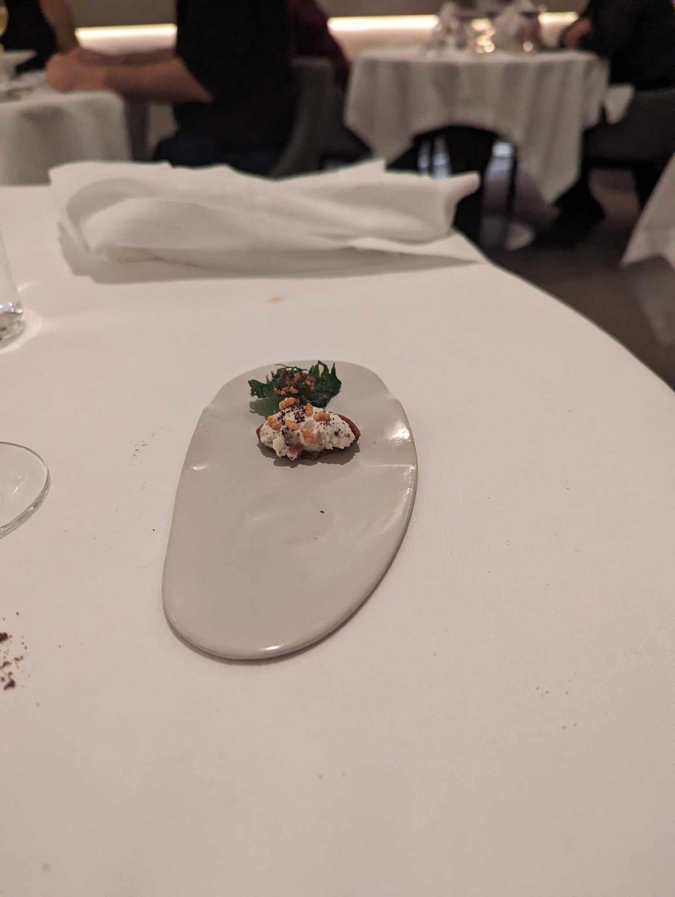

The Alliance ⭐
--------------
##### Modern French Cuisine with a Japanese Twist

The Alliance's name makes more sense with a bit of the backstory, which I looked up on the internet with a spot of Google
Translate. Thank god for modern technology. 

> The Alliance restaurant is above all a beautiful story. It is the story of a complicity that is as striking as it is obvious between Toshitaka Omiya, a Japanese chef originally from Osaka, and Shawn Joyeux, a self-taught waiter with a passion for wine (700 references on the menu). In November 2015, the duo inaugurated this first address, in a discreet street in the 5th arrondissement, a few steps from Boulevard Saint-Germain.

I am not exactly sure about the use of the word _complicity_ here, but as I started to dawn one of my new suits, I became 
increasingly excited for the meal ahead. It might also have been the double Nespresso I drank that was absolutely loaded
with sugar. 

Arriving at _The Alliance_, we were greeted by none other than Shawn Joyeux, the self-taught waiter with a passion for wine.
I was nervous about our first dining experience in Paris. Truth be told, it is somewhat hard to not think about the numerous
statements Americans will make about Paris, especially in the American South. I was worried these sophisticates would balk
at my inability to speak French, minus the memorized phrase, "I do not speak French. Do you speak English? I also speak Spanish." 

True to form, I belted out my phrase to Shawn, who responded jokingly in Spanish before switching to perfect English. My 
nerves began to melt away as they took my coat and we were seated. The restaurant was bright white and intimate. There is
an open kitchen in the back, and they seated Caitlin facing toward it while I got a view of the Parisian streets and other diners.

I always enjoy people watching and noted that there were numerous Japanese folks dining at the restaurant. I assume that Toshi's
mastery of French cuisine has inspired folks in Japan to make a similar sort of pilgrimage as Caitlin and I are. There was also 
a table of three French, all drinking wine, laughing and enjoying themselves. A couple of Americans were seated behind us,
nearer to the kitchen. We could tell they were Americans from their accents and because they announced it upon arriving.

The sommelier came over and asked if we would like to start with a glass of champagne. Of course we would. The amuse bouche 
("it tickles the mouth") consisted of some cabbage stuffed with something wonderful. You could have told me it was stuffed with 
cream, or pate, or even a bit of foie gras and I would have believed you. It was delicious, but my ability to focus on the waiter's
words instead of the sensory wonder in front of us was already beginning to wane. 

Next, we had some breads. One was a stick, with some sort of cinnamon treatment, while the other was a cheese roll that was as light as air.
Both were delicious, and I was becoming increasingly excited. If bread is this dang good, imagine the other dishes. 

A soup followed, that was a bit of pureed squash with a coffee foam and some other morsels that were unidentifiable, but
also delicious. It wasn't heavy, but did have a hearty warmth to it. 

The first protein course arrived after this, and it was everything I was hoping for. A wafer, impossibly made of scallops,
and harkening back perhaps to the chef's Japanese origins was arrayed with what appeared to be a Combo. However, unlike 
a Combo, there was a thin crunchy exterior hiding a mousse of foie gras. Lastly, this was served with a spponful of caviar
and I began to feel as if my life was complete.

The fifth course was a second protein and decidedly decadent. An oyster steamed in its shell with a foam made from the
broth, topped with little dollops of caviar. I think they use caviar like it is salt here. 

Following this, was the first of two truffle riddled dishes. Truffle is a fungus that grows on the roots of trees, and is
considered a delicacy. It is also very expensive. Truffles are apparently used widely here, because you can even get black
truffle chips for the cost of a bag of Lay's -- wild. This was truffles atop a potato puree with little
fried potato chips and was everything you might imagine and probably a little more. 

The next dish was our only addition outside of the wine pairing. It was a truffle pasta. Laden with white truffles, and a 
rich cheese sauce, some handmade noodles that seemed like a cross between ramen and spaghetti were laid across my plate. 
This was the highlight and something I will remember for a long time.

Next up, some scallops and a few bites of a grilled cheese that the french, of course, have a more elegant term for. You might 
think this was designed to be slightly less rich than the previous two dishes, but you would be wrong. The scallops were in 
a rich sauce, and the croque monsiuers were delightfully buttery. 

The next dish was the fever dream of a man with a love for rich, creamy sauces and a treasure chest full of caviar. Small, perfect
gnocchi were served in a sauce that was so rich, I could feel my arteries clogging. It was also topped with a generous portion
of caviar which was mixed into the sauce. What a dish.

The next two courses were introduced as the "mains." They were made from a black footed chicken which was toured amongst the 
diners before being taken back to the kitchen. The first was a a morsel of chicken, with lobster. It was served in a delicious broth
made of lobster and chicken. While the broth was decadent and delicious, the protein skewer felt flat. It was good, but not
like the other dishes thus far. 

Next, the chicken came served alone and was delightful. It was much better with its crispy skin not soaked in broth and came 
atop a foam and bed of greens that I believe were chestnut greens. This was also the only dish served with red wine. A mix of 
pinot noir and gamay, it was a perfect pairing.

After this, we rounded into our desserts for the evening. The first was a fennel infused sorbet with some delightfully refreshing
fruit. This was a godsend as I was beginning to feel the effects of the rich food.

The next dessert was a chocolate log with rich crackers filled with a nutty cream core. I don't normally like dessert in general, 
but this took the cake as possibly my favorite course. Served with champagne, it was a thing of beauty. Caitlin remarked to Shawn 
that I don't normally care for desserts and he offered another on the house to me, but I had to refuse. I feared a second of these
would cause me to explode, or have a heart attack, or some sort of divine retribution for my gluttony.

Lastly, there were some crackers topped with cheeses and other things that I ate more out of obligation than actual desire. I
was stuffed. It had been almost four hours, and I had drank fourteen glasses of wine and champagne. Not full glasses, I am sure, 
as I wasn't falling over drunk. But it was a lot. 

Thinking back about the stories of the pompous French, I must say I find the tales to be a bit silly. These were delightful people, 
and they brought us into their lives and shared their stories freely. Shawn told us how when they first opened, it was only a week 
after the terrorist attacks in France that claimed over a hundred lives. The stark contrast of those who would cause terror
and the chef and waiter who wanted to bring joy. They couldn't get any bookings and begged their friends to come. Or our very
funny waiter, who kept us on our toes throughout the meal. At some point in the four hour meal, Caitlin needed to use the restaurant. The waiter brought her to the entrance of the
restaurant and pointed down the street and said just past that van, you will find a door. He was joking, and, man, did she
have a laugh. We have often joked that you can tell how many stars a restaurant will have by the bathroom experience alone, and this held true.

(As an aside, we go to the one star Japanese restaurant Mujö in Atlanta with some frequency which is where we came up with this rule
of thumb. They have imported Japanese toilets laden with more buttons than an average remote control, all in Japanese. Discovering
what those buttons do is in and of itself a sensory experience, if you get my drift.) 

As we wandered back to our eclectic apartment, the vague smell and drab streets from the morning had been replaced by a feeling
that this was a place I could easily feel I belong. We stopped and stared at the window of a store next to the apartment 
wondering what it was exactly. A friendly man exited the bathroom shirtless, inviting us in as he threw on his shirt and reopened
the shop.  I write this early in the morning, and my reflection that the stories of Paris were unfounded remains unchanged.

Tomorrow, we will be heading to the Arc de Triomphe and a lunch at the nearby restaurant, Masion Rostang. Another star for lunch,
followed by a new years dinner at a two star. I am not sure how I will survive, but I am excited to try.